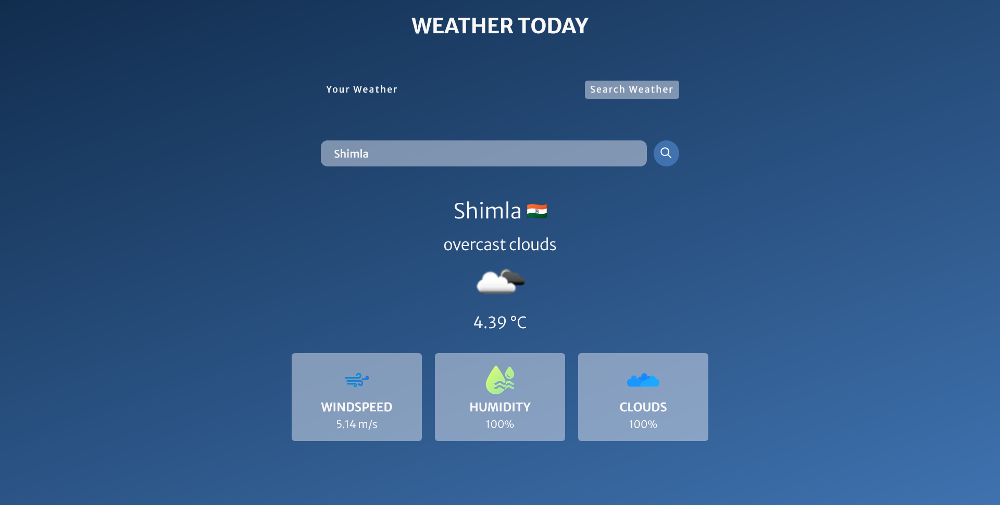

## React Weather App

Visit live <a href='https://world-weather-today.netlify.app/' target='_blank'>link</a>

Welcome to the React Weather App - a user-friendly web application that provides weather details for the current location based on the user's GPS coordinates. Additionally, users can search for weather information for different cities.

 
# Features

 Current Location Weather: Get real-time weather details for your current location based on your device's GPS coordinates.

 City Search: Enter the name of any city to fetch its weather information.

 Detailed Weather Information: Receive comprehensive weather data, including temperature, humidity, wind speed, and more.

 
# Connect

Visit me on <a href='https://www.linkedin.com/in/manish-kumar-singh-12a28a190/' target='_blank'>linkedin</a> and <a href='https://twitter.com/Manish_03_Singh' target='_blank'>twitter</a>

